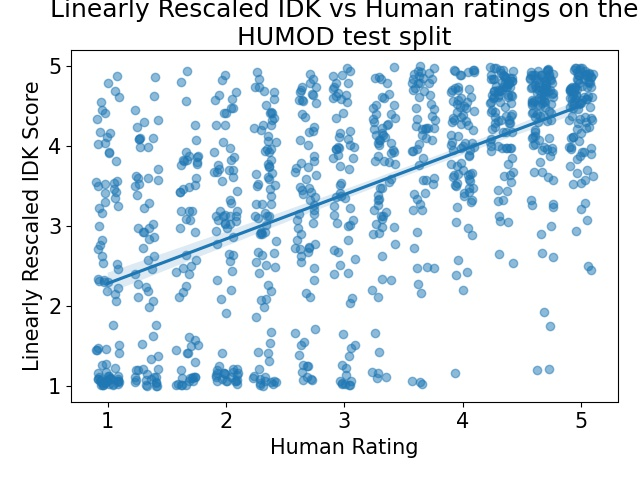

# IDK: Dialogue Relevance

This repository contain the code required to replicate the experiments
and data processing for the paper "Relevance in Dialogue: An empirical 
comparison of existing metrics, and a novel simple metric"

All files are Python 3.6.9 code, necessary libraries can be found in requirements.txt

## Instructions

### For reproducing the IDK and COS-BERT experiments

1. Delete the existing `exp` folder if you wish to reproduce. Otherwise,
you can immediately perform steps 6., 8., and the second half of 9.
2. Download files outlined in `data` subfolder's README
3. Run `preprocess.py`
4. To reproduce BERT all coherence experiments (i.e., COS-BERT),
then run `run_bert_coherence.sh`, and check the created subfolders under `exp`. 
Note that repetitions are not used, as the pretrained BERT is fixed, thus
outputs are deterministic
5. To train models and get validation set performance: `python3 -u run_triplet.py | tee log_run_triplet.txt`
6. To view validation results: `python3 display_val_results2.py`
7. To evaluate on test set, `python3 test_triplet.py`
8. To view test results: `python3 display_test_results.py`
9. To create plots from paper: First save model's predictions using
`python3 test_triplet_save_examples.py`. Then create plot with `python3 create_plots.py`
10. To reproduce experiment using pretrained BERT NSP predictor directly for relevance prediction,
run `runk_bert_nsp.sh` 

### For reproducing experiments using prior metrics (i.e., BERT-NUP, COS-FT, NORM-PROB)

After downloading files outlined in `data` folder and running
`preprocess.py`, change directory into `data` folder and run 
`csv_ify.py`. This will create the `csv` folder containing the data
in csv format. Then change directory into the `data/lines` directory
and run all python scripts there. This will convert the data into a 
single value-per line format.

Next, just go to the `external_projects` subdirectory that you are intested,
check the corresponding README, checkout the corresponding project, and replace
the files/follow the instructions provided.

Code to reproduce the GRADE, DynaEval, and FED metric (i.e. FED-REL 
and FED-COR) are together as all are a joint modification
of the codebase in https://github.com/exe1023/DialEvalMetrics

### For reproducing BERT NSP masking experiments

Run `histogram/test_nsp_DATASET_all.py`. These files use the
mask stored in `histogram/mask_7_humod_idk_l1_bce.pt`; to generate
this file using the provided checkpoints, just run `histogram/make_hist.py` from
the root directory.
